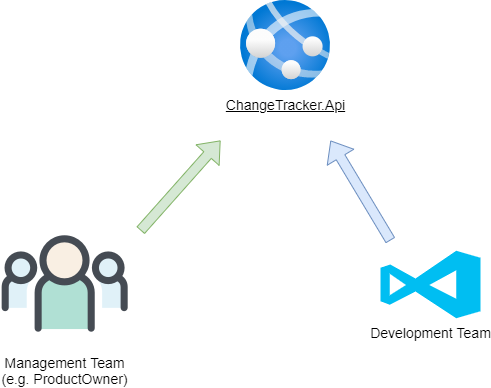
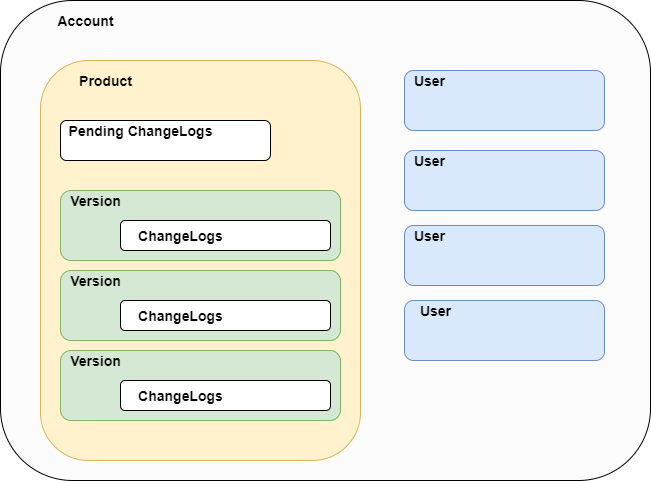

# ChangeTracker - empower your releases

ChangeTracker is a web service that enables you to keep track of your releases and changes.  

Due to the continuous movement towards microservices, releases are harder to track.  
Often monoliths get subdivided into many micro/nano services, each of them is deployed independently with its own versioning.  

Imagine you're a product owner who is responsible for many products.  
In order to communicate changes to the customer you need to be up-to-date about releases.  
Maybe you talk to the developer directly or call an api info endpoint to get the latest deployed version.  
After that, you check what's inside this release in your ticket system to be informed about the latest changes.  

This can be quite cumbersome with an increasing number of products.  

A possible solution is to invert the dependencies.  
The management team where the product owner belongs should not depend on developers,  
both should depend on a web service.  

  

The development team automatically pushes its changes during deployment with all the information the management team needs.

## Disclaimer

This is a side project that should not be used in productive environment.  

## Basic Concept

### Account

An Account is a grouping of users and prodcuts.  
User permissions can granted on account and product level.  
Product permissions have precedence over account permissions.  

e.g.  
A user can have a developer role on account level and a support role for one specific product within the account.  
In this case the user has for all account products developer permissions expect the one specific product.  
This is restricted to support permissions.  

This works the other way around as well.  
You can grant support permissions on account level and developer permissions for specific products.  
So the user has more permission for the specific products.  

However, there is not yet a user interface to do this. (future extension)

### User

Right now, the following user information are stored

* Email
* Firstname
* Lastname
* Timezone(IANA)

### Product

A product is the software on which developers work.  
It has no end date, but it can be closed.  
By closing a product you stop working on that software.  
The product will still exist but it becomes read-only  
with all its versions and change logs.

### Version

A version is a unique string assigned to a product.  
There are three states that a version can have.  

* Not Released and Not Deleted
* Released
* Deleted

The last two make versions read-only.  
Version properties including the change logs can be modified as long it hasn't been deleted or released.  
Deleted versions can still be fetched from the api.  
The appropriate endpoints provide a switch **IncludeDeleted** to include these versions in the response.

### Pending ChangeLogs

When developing software, you often don't know to which version your changes belong.  
In order to delay this decision, you can add pending change logs.  
The change logs belong to the product only and can assigned to a version later.  
The max number of pending change logs is 100.

### ChangeLogs

Change logs are always assigned to a version  
and can be modified as long as the related version isn't released or deleted.  
The max number of change logs is 100.

### Overview

## Architecture

The architecture of the app is mainly influenced by:

* Robert C. Martin's book Clean Architecture
* Mark Seemann's book Dependency Injection Principles, Practices, and Patterns
* Plainionist's article series [Implementing-Clean-Architecture](http://www.plainionist.net/Implementing-Clean-Architecture-Overview/)
* [CandiedOrange's](https://softwareengineering.stackexchange.com/users/131624/candied-orange) [answers](https://softwareengineering.stackexchange.com/search?q=user:131624+[clean-architecture]) on softwareengineering.stackexchange

## Key Features

* Multi-tenant capabilities
* Role-based access control
* Full-text Search for versions and change logs

## CI/CD

Every commit pushed to the remote repo triggers the **Continuous Integration** stage  
where the app is built and all tests are executed.  

The **Continuous Delivery** stage will run afterwards if the commit was tagged.  
By doing so, the app gets deployed to the staging environment  
and after a manual approval to the production environment.  

Tag names must be a valid SemVer 2.0.0.  
The version in `latest-changes.json` will be compared to the tag name while deploying.  
If these values are different, the pipeline fails.  

### CiCd Overview

## Environments

### Testing

This environment consists only of a database that is used by integration tests.

### Staging

Is a replica of the production environment.  
Uses the same Docker registry and App Service Plan as the production system.  

[Staging](https://app-change-tracker-staging.azurewebsites.net/)

### Production

Actual app

[Production](https://app-change-tracker.azurewebsites.net/)

## Database

I decided to use a SQL database rather than a NoSQL db,  
because relational databases are a mature technology that meet most of my requirements.

[Database Schema](./docs/assets/ChangeTrackerDbSchema.png)

## DbConnection

There are two rules of thumb when working with db connections

* Open it as late as possible (during an http request)
* Close it as soon as possible

### How to get a db connection?  

Two types were designed to work with db connections.  

* `Func<IDbConnection>`
* `IDbAccessor`

These two types can be injected into the constructor  
but only in the data access layer.

### `Func<IDbConnection>`

This factory should be used in situations where no transaction is required.  
An example is the authentication handler that verifies the user's identity.  
This will never be part of a transaction.  

Things to keep in mind when working with `Func<IDbConnection>`.

* Wrap the connection in a `using` block since it's an ephemeral disposable
* Does not work with `IUnitOfWork`
* Can be used in concurrent situations

### `IDbAccessor`

Contains only the property `DbConnection` that can be used safely  
without worrying about opening or closing/disposing connections or transactions.  
This is handled by the DbSession, Dapper and the DI Container.  

`IDbAccessor` was designed to deal with transactions  
that are controlled by **Unit of Works** in the application layer.  

Things to keep in mind when working with `IDbAccessor`

* Do not dispose connections
* Do not open or close connections
* Do not begin transactions
* Do not use it in concurrent scenarios
* Use it with Dapper only

## Next Steps

* Refactor Deployment: use continuous deployment instead of continuous delivery
* Refactor Permission queries: return a more verbose output about not found resources
* Experimental: write the domain in `F#` since it is a better domain language
* Build a management api for accounts and users that uses OAuth 2.0
* Frontend (Needs to be learnt): build an angular app for managing accounts & users and working with releases and changes
* Authentication: extend the api to deal with Jwt access tokens and the existing api key header
